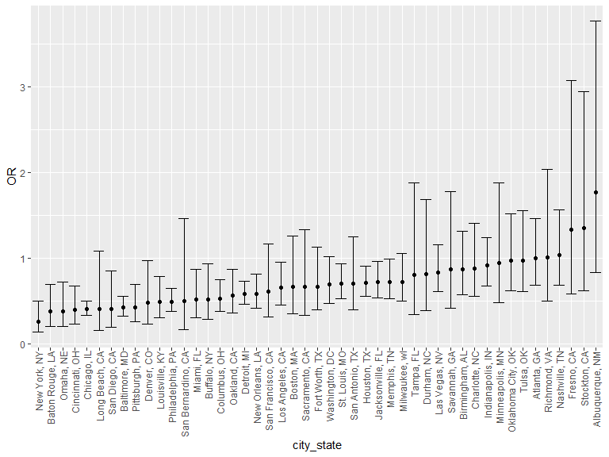
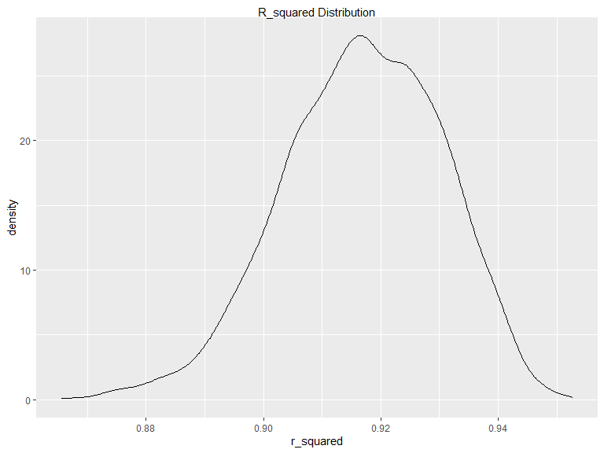
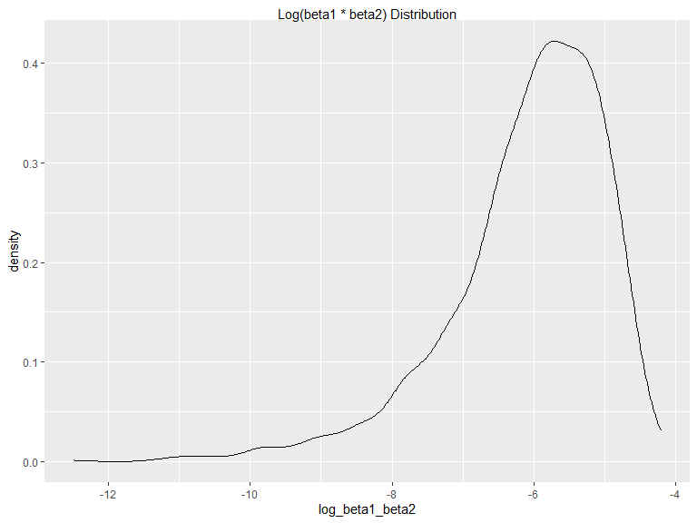

p8105_hw6_hj2660
================
Hyun Jin Jung
2023-12-2

### Problem 1

In the data cleaning code below we create a `city_state` variable,
change `victim_age` to numeric, modifiy victim_race to have categories
white and non-white, with white as the reference category, and create a
`resolution` variable indicating whether the homicide is solved. Lastly,
we filtered out the following cities: Tulsa, AL; Dallas, TX; Phoenix,
AZ; and Kansas City, MO; and we retained only the variables
`city_state`, `resolution`, `victim_age`, `victim_sex`, and
`victim_race`.

``` r
homicide_df = 
  read_csv("data/homicide-data.csv", na = c("", "NA", "Unknown")) |> 
  mutate(
    city_state = str_c(city, state, sep = ", "),
    victim_age = as.numeric(victim_age),
    resolution = case_when(
      disposition == "Closed without arrest" ~ 0,
      disposition == "Open/No arrest"        ~ 0,
      disposition == "Closed by arrest"      ~ 1)
  ) |> 
  filter(victim_race %in% c("White", "Black")) |> 
  filter(!(city_state %in% c("Tulsa, AL", "Dallas, TX", "Phoenix, AZ", "Kansas City, MO"))) |> 
  select(city_state, resolution, victim_age, victim_sex, victim_race)
```

    ## Rows: 52179 Columns: 12
    ## ── Column specification ────────────────────────────────────────────────────────
    ## Delimiter: ","
    ## chr (8): uid, victim_last, victim_first, victim_race, victim_sex, city, stat...
    ## dbl (4): reported_date, victim_age, lat, lon
    ## 
    ## ℹ Use `spec()` to retrieve the full column specification for this data.
    ## ℹ Specify the column types or set `show_col_types = FALSE` to quiet this message.

Next we fit a logistic regression model using only data from Baltimore,
MD. We model `resolved` as the outcome and `victim_age`, `victim_sex`,
and `victim_race` as predictors. We save the output as `baltimore_glm`
so that we can apply `broom::tidy` to this object and obtain the
estimate and confidence interval of the adjusted odds ratio for solving
homicides comparing non-white victims to white victims.

``` r
baltimore_glm = 
  filter(homicide_df, city_state == "Baltimore, MD") |> 
  glm(resolution ~ victim_age + victim_sex + victim_race, family = binomial(), data = _)

baltimore_glm |> 
  broom::tidy() |> 
  mutate(
    OR = exp(estimate), 
    OR_CI_upper = exp(estimate + 1.96 * std.error),
    OR_CI_lower = exp(estimate - 1.96 * std.error)) |> 
  filter(term == "victim_sexMale") |> 
  select(OR, OR_CI_lower, OR_CI_upper) |>
  knitr::kable(digits = 3)
```

|    OR | OR_CI_lower | OR_CI_upper |
|------:|------------:|------------:|
| 0.426 |       0.325 |       0.558 |

Below, by incorporating `nest()`, `map()`, and `unnest()` into the
preceding Baltimore-specific code, we fit a model for each of the
cities, and extract the adjusted odds ratio (and CI) for solving
homicides comparing non-white victims to white victims. We show the
first 5 rows of the resulting dataframe of model results.

``` r
model_results = 
  homicide_df |> 
  nest(data = -city_state) |> 
  mutate(
    models = map(data, \(df) glm(resolution ~ victim_age + victim_sex + victim_race, 
                             family = binomial(), data = df)),
    tidy_models = map(models, broom::tidy)) |> 
  select(-models, -data) |> 
  unnest(cols = tidy_models) |> 
  mutate(
    OR = exp(estimate), 
    OR_CI_upper = exp(estimate + 1.96 * std.error),
    OR_CI_lower = exp(estimate - 1.96 * std.error)) |> 
  filter(term == "victim_sexMale") |> 
  select(city_state, OR, OR_CI_lower, OR_CI_upper)

model_results |>
  slice(1:5) |> 
  knitr::kable(digits = 3)
```

| city_state      |    OR | OR_CI_lower | OR_CI_upper |
|:----------------|------:|------------:|------------:|
| Albuquerque, NM | 1.767 |       0.831 |       3.761 |
| Atlanta, GA     | 1.000 |       0.684 |       1.463 |
| Baltimore, MD   | 0.426 |       0.325 |       0.558 |
| Baton Rouge, LA | 0.381 |       0.209 |       0.695 |
| Birmingham, AL  | 0.870 |       0.574 |       1.318 |

Below we generate a plot of the estimated ORs and CIs for each city,
ordered by magnitude of the OR from smallest to largest. From this plot
we see that most cities have odds ratios that are smaller than 1,
suggesting that crimes with male victims have smaller odds of resolution
compared to crimes with female victims after adjusting for victim age
and race. This disparity is strongest in New yrok. In roughly half of
these cities, confidence intervals are narrow and do not contain 1,
suggesting a significant difference in resolution rates by sex after
adjustment for victim age and race.

``` r
model_results |> 
  mutate(city_state = fct_reorder(city_state, OR)) |> 
  ggplot(aes(x = city_state, y = OR)) + 
  geom_point() + 
  geom_errorbar(aes(ymin = OR_CI_lower, ymax = OR_CI_upper)) + 
  theme(axis.text.x = element_text(angle = 90, hjust = 1))
```



# Problem 2

Load Central Park weather data

``` r
weather_df = 
  rnoaa::meteo_pull_monitors(
    c("USW00094728"),
    var = c("PRCP", "TMIN", "TMAX"), 
    date_min = "2022-01-01",
    date_max = "2022-12-31") |>
  mutate(
    name = recode(id, USW00094728 = "CentralPark_NY"),
    tmin = tmin / 10,
    tmax = tmax / 10) |>
  select(name, id, everything())
```

    ## using cached file: C:\Users\16175\AppData\Local/R/cache/R/rnoaa/noaa_ghcnd/USW00094728.dly

    ## date created (size, mb): 2023-12-02 14:24:54.099863 (8.561)

    ## file min/max dates: 1869-01-01 / 2023-11-30

Fitting regression model

``` r
fit = lm(tmax ~ tmin + prcp, data = weather_df)

summary(fit)
```

    ## 
    ## Call:
    ## lm(formula = tmax ~ tmin + prcp, data = weather_df)
    ## 
    ## Residuals:
    ##     Min      1Q  Median      3Q     Max 
    ## -6.3705 -1.9950 -0.0249  1.4974 20.4503 
    ## 
    ## Coefficients:
    ##              Estimate Std. Error t value Pr(>|t|)    
    ## (Intercept)  8.042803   0.230065  34.959   <2e-16 ***
    ## tmin         1.013386   0.016154  62.734   <2e-16 ***
    ## prcp        -0.001541   0.002103  -0.733    0.464    
    ## ---
    ## Signif. codes:  0 '***' 0.001 '**' 0.01 '*' 0.05 '.' 0.1 ' ' 1
    ## 
    ## Residual standard error: 2.956 on 362 degrees of freedom
    ## Multiple R-squared:  0.916,  Adjusted R-squared:  0.9155 
    ## F-statistic:  1972 on 2 and 362 DF,  p-value: < 2.2e-16

Create sample for Bootstrap

``` r
boot_sample = function(weather_df){
  sample_frac(weather_df, replace = TRUE)
}

boot_straps =
  tibble(strap_number = 1:5000) |> 
  mutate(
    strap_sample = map(strap_number, \(i) boot_sample(weather_df))
  )
```

Estimates of $\hat{r}^2$ and $\log(\hat{\beta}_1 * \hat{\beta}_2)$ for
each sample.

``` r
r_squared = boot_straps |>
  mutate(
    models = map(strap_sample, \(weather_df) lm(tmax ~ tmin + prcp, data = weather_df)),
    rs_results = map(models, broom::glance)) |>
  select(strap_number, rs_results) |>
  unnest(rs_results) |>
  select(strap_number, r_squared = r.squared) 

log_estimate = 
  boot_straps |> 
  mutate(
    models = map(strap_sample, \(weather_df) lm(tmax ~ tmin + prcp, data = weather_df)),
    log_results = map(models, broom::tidy),
  ) |> 
  select(strap_number, log_results) |> 
  unnest(log_results) |>
  select(strap_number, term, estimate) |> 
  pivot_wider(
    names_from = term,
    values_from = estimate
  ) |> 
  mutate(log_beta1_beta2 = ifelse(tmin * prcp > 0, log(tmin * prcp), NA)) |> 
  select(strap_number, log_beta1_beta2)

boot_results =
  inner_join(r_squared, log_estimate)
```

    ## Joining with `by = join_by(strap_number)`

The warning `NaNs produced` is triggered when the expression
`log(tmin * prcp)` results in non-positive values, so I replaced those
NAN values with NA using `ifelse`. Then, used `inner_join` to combine
two results.

Plot the distribution of $\hat{r}^2$ and
$\log(\hat{\beta}_1 * \hat{\beta}_2)$.

``` r
boot_results |> 
  ggplot(aes(x = r_squared)) + 
  geom_density() +
  labs(title = "R_squared Distribution")
```



``` r
boot_results |> 
  ggplot(aes(x = log_beta1_beta2)) + 
  geom_density() +
  labs(title = "Log(beta1 * beta2) Distribution")
```



These density plots visually represent the distribution of the bootstrap
estimates for $\hat{r}^2$ and $\log(\hat{\beta}_1 * \hat{\beta}_2)$. The
plot for $\hat{r}^2$ shows a distribution that is very close to normal,
with a slight left-skewness. The values span a range from approximately
0.865 to 0.952.

In contrast, the plot for $\log(\hat{\beta}_1 \cdot \hat{\beta}_2)$
shows a distinct left-skewness. Several rows had to be removed due to
non-finite values, as indicated by the warning message `NaNs produced`.
This issue arose from attempting to take the logarithm of negative
values.

Calculate 95% confidence intervals for $\hat{r}^2$ and
$\log(\hat{\beta}_1 * \hat{\beta}_2)$.

``` r
boot_results |> 
  summarize(
    r_squared_CI_lower = quantile(r_squared, 0.025),
    r_squared_CI_upper = quantile(r_squared, 0.975),
    log_beta1_beta2_CI_lower = quantile(log_beta1_beta2, 0.025, na.rm = TRUE),
    log_beta1_beta2_CI_upper = quantile(log_beta1_beta2, 0.975, na.rm = TRUE)
  ) |> 
  knitr::kable(digits = 3)
```

| r_squared_CI_lower | r_squared_CI_upper | log_beta1_beta2_CI_lower | log_beta1_beta2_CI_upper |
|-------------------:|-------------------:|-------------------------:|-------------------------:|
|              0.889 |              0.941 |                   -8.982 |                   -4.602 |

We are 95% confident that the true $\hat{r}^2$ lies between 0.889 and
0.941, and we are 95% confident that the true
$\log(\hat{\beta}_1 * \hat{\beta}_2)$ lies between -8.982 and -4.602.

# Problem 3

Import and clean data

``` r
bw_df = read_csv("data/birthweight.csv") |>
  mutate(
    babysex = as.factor(babysex),
    frace = as.factor(frace),
    malform = as.factor(malform),
    mrace = as.factor(mrace))
```

    ## Rows: 4342 Columns: 20
    ## ── Column specification ────────────────────────────────────────────────────────
    ## Delimiter: ","
    ## dbl (20): babysex, bhead, blength, bwt, delwt, fincome, frace, gaweeks, malf...
    ## 
    ## ℹ Use `spec()` to retrieve the full column specification for this data.
    ## ℹ Specify the column types or set `show_col_types = FALSE` to quiet this message.

``` r
colSums(is.na(bw_df))
```

    ##  babysex    bhead  blength      bwt    delwt  fincome    frace  gaweeks 
    ##        0        0        0        0        0        0        0        0 
    ##  malform menarche  mheight   momage    mrace   parity  pnumlbw  pnumsga 
    ##        0        0        0        0        0        0        0        0 
    ##    ppbmi     ppwt   smoken   wtgain 
    ##        0        0        0        0

Converted numeric to factor. Then used `colSums(is.na(bw_df))` to see if
there’s any missing data, and there wasn’t.

Fitting regression model

``` r
full_model = lm(bwt ~., data = bw_df)

summary(full_model)
```

    ## 
    ## Call:
    ## lm(formula = bwt ~ ., data = bw_df)
    ## 
    ## Residuals:
    ##      Min       1Q   Median       3Q      Max 
    ## -1097.68  -184.86    -3.33   173.09  2344.15 
    ## 
    ## Coefficients: (3 not defined because of singularities)
    ##               Estimate Std. Error t value Pr(>|t|)    
    ## (Intercept) -6265.3914   660.4011  -9.487  < 2e-16 ***
    ## babysex2       28.7073     8.4652   3.391 0.000702 ***
    ## bhead         130.7781     3.4523  37.881  < 2e-16 ***
    ## blength        74.9536     2.0217  37.075  < 2e-16 ***
    ## delwt           4.1007     0.3948  10.386  < 2e-16 ***
    ## fincome         0.2898     0.1795   1.614 0.106551    
    ## frace2         14.3313    46.1501   0.311 0.756168    
    ## frace3         21.2361    69.2960   0.306 0.759273    
    ## frace4        -46.9962    44.6782  -1.052 0.292912    
    ## frace8          4.2969    74.0741   0.058 0.953745    
    ## gaweeks        11.5494     1.4654   7.882 4.06e-15 ***
    ## malform1        9.7650    70.6259   0.138 0.890039    
    ## menarche       -3.5508     2.8951  -1.226 0.220083    
    ## mheight         9.7874    10.3116   0.949 0.342588    
    ## momage          0.7593     1.2221   0.621 0.534418    
    ## mrace2       -151.4354    46.0453  -3.289 0.001014 ** 
    ## mrace3        -91.3866    71.9190  -1.271 0.203908    
    ## mrace4        -56.4787    45.1369  -1.251 0.210901    
    ## parity         95.5411    40.4793   2.360 0.018307 *  
    ## pnumlbw             NA         NA      NA       NA    
    ## pnumsga             NA         NA      NA       NA    
    ## ppbmi           4.3538    14.8913   0.292 0.770017    
    ## ppwt           -3.4716     2.6121  -1.329 0.183913    
    ## smoken         -4.8544     0.5871  -8.269  < 2e-16 ***
    ## wtgain              NA         NA      NA       NA    
    ## ---
    ## Signif. codes:  0 '***' 0.001 '**' 0.01 '*' 0.05 '.' 0.1 ' ' 1
    ## 
    ## Residual standard error: 272.5 on 4320 degrees of freedom
    ## Multiple R-squared:  0.7183, Adjusted R-squared:  0.717 
    ## F-statistic: 524.6 on 21 and 4320 DF,  p-value: < 2.2e-16

I constructed a regression model for birthweight by including all
available variables as predictors. Each of these variables is considered
meaningful in contributing to the variation in a child’s birthweight.

``` r
bw_df |> 
  modelr::add_residuals(full_model) |> 
  modelr::add_predictions(full_model) |> 
  ggplot(aes(x = pred, y=resid)) + 
  geom_point(alpha = 0.5) +
  geom_smooth(method = "lm") +
  labs(x = "Fitted values", 
       y = "Residuals", 
       title = "Model Residuals vs. Fitted Values")
```

    ## `geom_smooth()` using formula = 'y ~ x'


This plot enables the observation that the residuals scatter around 0.

``` r
#use length at birth and gestational age as predictors (main effects only)
model_1 = lm(bwt ~ blength + gaweeks, data = bw_df)

#use head circumference, length, sex, and all interactions (including the three-way interaction) 
model_2 = lm(bwt ~ (bhead + blength + babysex)^3, data = bw_df)
```

``` r
cv_df = crossv_mc(bw_df, 100) |>
  mutate(
    train = map(train, as_tibble), 
    test = map(test, as_tibble))
```

Made cross-validation on the `bw_df` dataset, creating 100 random splits
into training and testing sets.

Compare your model to two others:

``` r
cv_df |>
  mutate(
    proposed_mod = map(train, \(df) lm(bwt ~., data = df)),
    main_effect_mod = map(train, \(df) lm(bwt ~ blength + gaweeks, data = df)),
    interaction_mod = map(train, \(df) lm(bwt ~ bhead + blength + babysex + bhead * blength + blength* babysex + bhead* babysex + bhead * blength * babysex, data = df))
  ) |>
  mutate(
    rmse_proposed = map2_dbl(proposed_mod, test, \(mod, df) rmse(model = mod, data = df)),
    rmse_main = map2_dbl(main_effect_mod, test, \(mod, df) rmse(model = mod, data = df)),
    rmse_interaction = map2_dbl(interaction_mod, test, \(mod, df) rmse(model = mod, data = df)),
  ) |> 
  select(starts_with("rmse")) |> 
  pivot_longer(
    everything(),
    names_to = "model", 
    values_to = "rmse",
    names_prefix = "rmse_") |> 
  mutate(model = fct_inorder(model)) |> 
  ggplot(aes(x = model, y = rmse)) +
  geom_violin() +
  labs(x = "Model",
       y = "RMSE",
       title = "Models vs RMSE")
```


The proposed model, utilizing all predictors, achieved the lowest RMSE,
signifying the most accurate predictions on the test data. The main
effect model, with only birth length and gestational age as predictors,
yielded less accurate predictions. The interaction model, incorporating
all interactions and the three-way interaction, showed a moderately
higher RMSE, indicating less accuracy compared to the full predictor
set.

In summary, lower RMSE values signify better predictive performance.
However, it’s crucial to consider the specific context of the analysis
and modeling goals.
